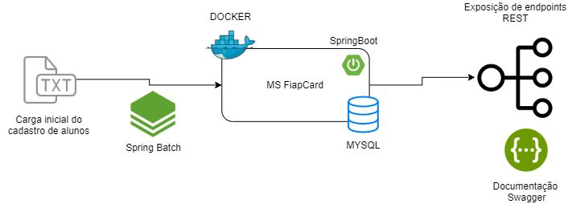
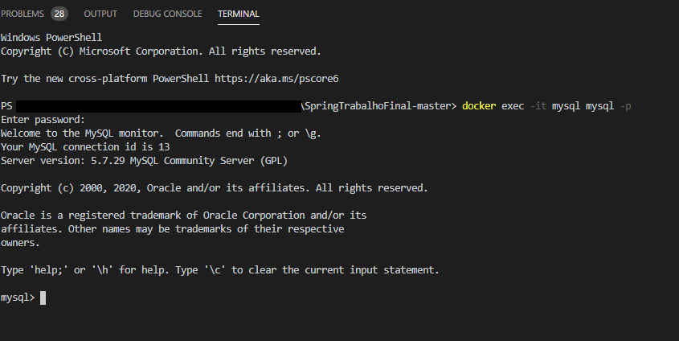
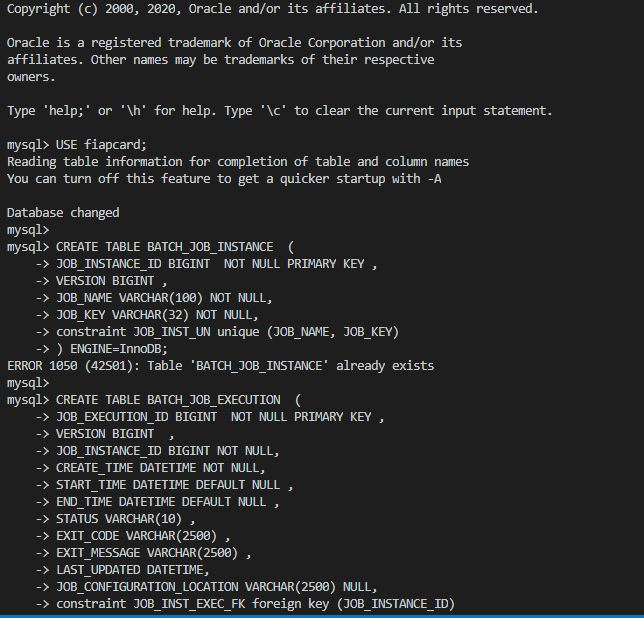

# Documentação da aplicação FiapCard

## Introdução

O FiapCard é um cartão especialmente feito para alunos da Fiap.
Qualquer aluno devidamente matriculado pode solicitar seu cartão.

## Arquitetura da aplicação

## Fazer o deploy da aplicação

O primeiro passo é clonar o repositório do Github e entrar no diretório da aplicação:

    git clone https://github.com/hodestito/SpringTrabalhoFinal.git
    cd SpringTrabalhoFinal

Toda a configuração necessária está contida no arquivo `docker-compose.yaml`. Para fazer o deploy executar o comando abaixo:

    docker-compose up

Após subir a aplicação no Docker, é necessário criar manualmente as tabelas de metadados do Spring Batch.

1.  Abrir um novo terminal para acessar o módulo administrativo do MySQL com o comando `docker exec -it mysql mysql -p` e usar senha `mysql`

2.  Copiar todo o script do arquivo `spring-batch-metadata.sql` localizado em `\src\main\resources` e colar no terminal do módulo administrativo do MySQL

A aplicação irá inicializar o serviço.

Importar a Collection via Postman, caso necessite de uma massa para testes (executar o conjunto "Insere Massa de Testes").
    
    FiapCard.postman_collection.json
 

## Chamadas aos endpoints

* **Alunos:** http://localhost:8080/alunos
* **Cartões:** http://localhost:8080/cartoes
* **Transacoes:** http://localhost:8080/transacoes
* **Carga batch:** http://localhost:8080/batch

Há no repositório uma collection do Postman com exemplos de chamada e uma massa simulada para cada endpoint.

## Documentação das APIs

* **Alunos:** Controla o cadastro de alunos matriculados na Fiap. Consultar documentação via Swagger

* **Cartões:** Controla o cadastro de cartões. Consultar documentação via Swagger 

* **Transações:** Controla as transações. Consultar documentação via Swagger

* **Batch:** Faz a carga do arquivo txt na base MySQL. Consultar documentação via Swagger

Link: http://localhost:8080/swagger-ui.html

## Ferramentas utilizadas

Para esta aplicação foram escolhidas as seguintes ferramentas:

- **Banco de dados**
  - **MYSQL** - É gratuito e leve, mesmo suportando aplicações robustas
  - **H2** - Banco de dados em memória. Utilizado para executar a aplicação em ambiente local para facilitar o desenvolvimento 
- **Docker** e **Docker-compose** - Facilitam a portabilidade das aplicações possibilitando deploy em diversas plataformas de forma rápida e transparente
